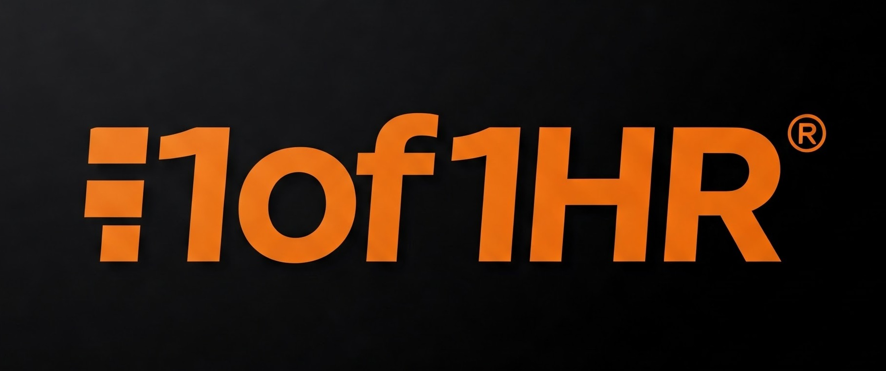

# 1of1 HR System

A comprehensive Human Resource Management System designed to streamline HR processes, manage employee information, and automate workflows.



## Features

- **Employee Management**: Store and manage comprehensive employee information
- **Leave Management**: Streamline leave requests and approvals
- **Time Management**: Track attendance and work hours
- **Recruitment**: Manage job postings, applications, and candidate pipelines
- **Document Management**: Securely store and organize HR documents
- **Training**: Plan and track employee training and development
- **Performance Management**: Conduct reviews and track employee performance
- **Payroll Integration**: Connect with payroll systems for seamless processing

## System Requirements

- Docker and Docker Compose
- Web browser (Chrome, Firefox, Edge, or Safari)

## Installation and Setup

### Using Docker (Recommended)

1. Clone this repository:

```
git clone https://github.com/0x1of1/EHR-Software.git
cd EHR-Software
```

2. Start the Docker containers:

```
docker compose up -d
```

3. Access the application:

   - Visit [http://localhost:9010/](http://localhost:9010/)
   - Login with the default credentials:
     - Admin: username `admin`, password `admin`
     - Manager: username `manager`, password `manager123`
     - Employee: username `employee`, password `employee123`

4. Access phpMyAdmin (for database management):
   - Visit [http://localhost:8080/](http://localhost:8080/)
   - Login with username `root` and password `IceHrmR00t`

## Development Environment

To set up a development environment:

```
git clone https://github.com/0x1of1/EHR-Software.git
cd EHR-Software
docker compose up -d
```

### Building Frontend Assets

When you make changes to JavaScript or CSS files, rebuild the frontend:

1. Install dependencies (first time only):

```
cd web
npm install
cd ..
npm install
```

2. Build assets during development:

```
gulp clean
gulp
```

3. Build assets for production:

```
gulp clean
gulp --eprod
```

## System Architecture

The 1of1 HR System follows the Model-View-Controller (MVC) architecture:

- **Core Directory**: Contains the core functionality and framework
- **App Directory**: Contains application-specific configurations
- **Web Directory**: Contains public assets (CSS, JavaScript, images)

## User Roles

The system supports multiple user roles with different permission levels:

- **Super Admin**: Full system access and configuration
- **Admin**: HR administrative capabilities
- **Manager**: Department-level management and approvals
- **Employee**: Self-service features and personal information management

## Customization

The system can be customized through:

1. **Configuration Settings**: Adjust system behavior through the admin interface
2. **Custom Fields**: Add custom fields to various modules
3. **Extensions**: Develop custom extensions for specific business needs

## Data Backup

All user uploaded files are stored under `docker/development/app_data`. Regular backups of this directory and the database are recommended.

## Support and Contribution

For issues, feature requests, or contributions, please use the GitHub issue tracker or submit a pull request.

## License

This software is licensed under the terms of the proprietary 1of1 Group license.
